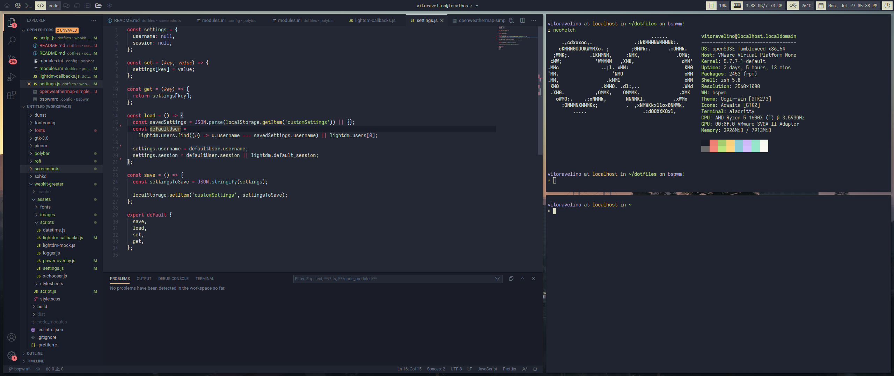
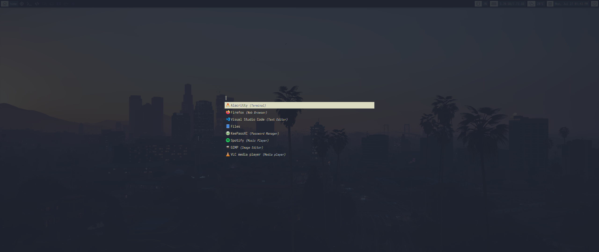
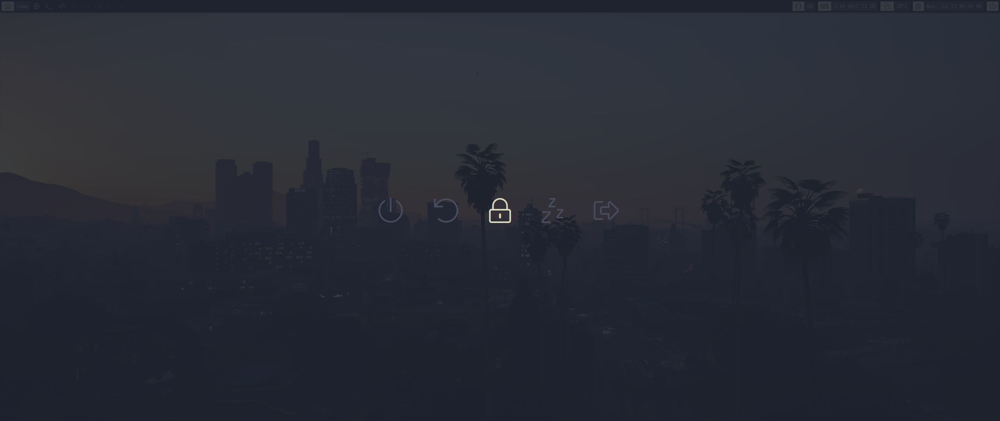

# Dotfiles & packages

This is an `openSUSE Leap (15.2)` and `Tumbleweed` based dotfiles & packages.

All you need to do is run the [install script](https://github.com/vitoravelino/dotfiles/blob/master/install.sh)
in the folder you want your dotfiles to be stored. To do that, you may either download and run the script manually,
or use the following `curl` or `wget` command:

```sh
$ curl -o- https://raw.githubusercontent.com/vitoravelino/dotfiles/master/install.sh | bash
```

```sh
$ wget -qO- https://raw.githubusercontent.com/vitoravelino/dotfiles/master/install.sh | bash
```

Be happy! :)

## Screenshots






